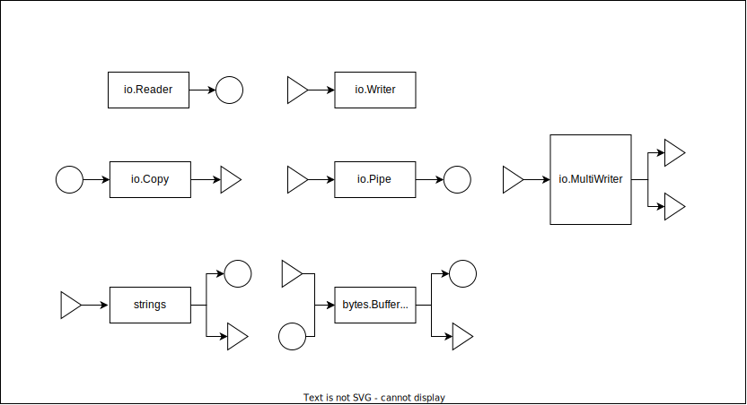

# Go言語の基本

参考：[A Tour of Go](https://go-tour-jp.appspot.com/welcome/1)

## Goプロジェクトの作成

プロジェクトを配置するディレクトリを作成し、そのディレクトリをカレントディレクトリにして以下のコマンドを実行する。

```sh
$ go mod init sample/go-basic-example
```
上記例ではパッケージ名を「sample/go-basic-example」としている。パッケージ名はプロジェクトに合わせて任意の名前を指定できる。

## 実行とビルド

```sh
# ビルドせず実行
$ go run ./main.go

# ビルド
$ go build -o ./build/main ./main.go
```

## パッケージ

### パッケージ名の基本

```go
package main   // <=== main パッケージの持ち物

import (
	"fmt"

	"sample/go-basic-example/service"
)

func main() {
	fmt.Println(service.Hello("World"))
}
```

Go言語のソースは必ず package を指定する。package はそのソースが入っているディレクトリ名。一つのディレクトリに異なるパッケージを含めることはできない。
例外的にUT用の xxxx_test パッケージは含めることができる。

パッケージには必ずパッケージの説明文をコメントとして記載する。

```go
// Package service アプリケーションのサービス
package service
```

説明文の配置はそのパッケージのソースであればどのソースでもよい。慣例としてパッケージの説明文用の doc.go ソースを作成することがある。

```sh
$ ls -1 ./service
doc.go        # <=== パッケージの説明を記入するソース
hello.g
```

外部に公開する関数やクラス、定数は名前を大文字から記載する。

```go
package service

// Hello パッケージの外部に公開する関数
func Hello(message string) string {
	return hello(message)
}

// hello パッケージ内でのみ利用できる関数
func hello(message string) string {
	return "Hello " + message
}
```

小文字から始まる名前でも、同一パッケージ内ではアクセス可能であることに注意。

### パッケージ名の命名規則

よいパッケージ名は以下の３つの条件に従う。

- 短く
- 関係
- 明快

パッケージ名は「小文字」の「1単語」であり、「priority_queue」や「computeServiceClient」のように区切り文字を使用してはいけない。
区切り文字を使用している場合はLintでエラーになることもあるため、区切り文字を使用する必要が出てきる場合はパッケージの構成を見直す必要がある。

参考：[Golangのパッケージ名はどうするのが正解か](https://zenn.dev/_kazuya/scraps/fdc65096b0d1d7)

パッケージ名に「-」区切りの名前は使用できない。

util や common、misc などの用途がはっきりしないパッケージ名は利用してはいけない。

例えば、

```go
package util
func NewStringSet(...string) map[string]bool {...}
func SortStringSet(map[string]bool) []string {...}
```

の場合、クライアントコードは

```go
set := util.NewStringSet("c", "a", "b")
fmt.Println(util.SortStringSet(set))
```

となるが、

```go
package stringset
func New(...string) map[string]bool {...}
func Sort(map[string]bool) []string {...}
```

であれば、以下のようにより簡潔に記述することができる。

```go
set := stringset.New("c", "a", "b")
fmt.Println(stringset.Sort(set))
```

参考：[よくないパッケージ名](https://zenn.dev/link/comments/e6b6b90b422a0d)

また、以下のようにパッケージ名と同じ名前のプレフィックスを付けるとLintエラーとなる。

```go
package stringset
func StringSetNew(...string) map[string]bool {...}
func StringSetSort(map[string]bool) []string {...}
```


### パッケージのインポート

同一ディレクトリ外のソースコードを import するときは、必ずフルパスで指定する。相対パスは使用できない。

```go
package main

import (
	"fmt"

	"sample/go-basic-example/service"   // <=== パッケージ名を含むフルパス
)

func main() {
	fmt.Println(service.Hello("World"))
}
```

## 変数と定数

```go
// 定数
const constant = "定数"

// 変数の定義と代入
variable := "変数の作成と代入"

// 変数の代入
variable = "変数の代入"

// 変数の定義
var defval string
defval = "定義と代入"
```

## 構造体

Go言語にはクラスがない。代わりに構造体をクラスのように利用する。

```go
// Person 構造体定義の基本
type Person struct {
    Name string     // パブリック変数
    Age int
    secret string   // プライベート変数
}

// インスタンス化
person := Person{Name:"山田太郎",Age: 23}
personptr := &Person{Name:"山田太郎",Age: 23}

// Runner Runner構造体 Person構造体を継承
type Runner struct {
    Person
    Speed int
}

// インスタンス化
runner := Runner{
    Person: Person{Name: "山田太郎", Age: 23},
    Speed:  13,
}
runnerptr := &Runner{
    Person: Person{Name: "山田太郎", Age: 23},
    Speed:  13,
}
```

```go
// Say パブリックメソッド
func (x *Person) Say(text string) string {
    return x.Name + ":" + text
}

// プライベートメソッド
func (x *Person) say(text string) string {
    return x.Name + ":" + text
}

// SayAll クラスメソッド
func (Person) SayAll(text string) string {
    return "Person:" + text
}
```

```go
// 無名構造体
person := struct {
    Name string
    Age  int
}{
    Name: "山田太郎",
    Age:  23,
}
```

## go:embed

参考：[Go 1.16からリリースされたgo:embedとは](https://future-architect.github.io/articles/20210208/)

embed はファイルをそのままビルドされたバイナリに埋め込み、ファイルや定数として扱える機能である。

```sh
# assets ディレクトリに data.go と hello.txt を配置
$ ls -1 assets
data.go
hello.txt
```

data.go は下記の通り。コメントの「//go:embed hello.txt」が埋め込みファイルであり、次の HelloTextBytes が embed hello.txt を指すデータになる。

```go
// Package assets 埋め込みテキストデータ
package assets

import (
	_ "embed"
)

//go:embed hello.txt
var HelloTextBytes []byte
```

hello.txt は「Embed Hello World!」テキストを含むファイル。HelloTextBytes がこのテキストデータになる。

```text
Embed Hello World!
```

HelloTextBytes の使用例。

```go
package main

import (
	"fmt"

	"sample/go-basic-example/assets"
)

func main() {
	fmt.Println(string(assets.HelloTextBytes))
}
```

変数型を embed.FS にするとファイルとして扱うことができる。

```go
// Package assets 埋め込みテキストデータ
package assets

import "embed"

//go:embed *.txt
var EmbedTextFile embed.FS
```

```go
package main

import (
	"fmt"

	"sample/go-basic-example/assets"
)

func main() {
    // hello.txt をファイルとして読み込む
	data, err := assets.EmbedTextFile.ReadFile("hello.txt")
	if err != nil {
		panic(err)
	}
	fmt.Println(string(data))
}
```

## time

参考：[【Go】now で日付操作](https://zenn.dev/shinshin/articles/b3c84d4bc71d3205b6f4)  
参考：[Go で日付をフォーマットする場合は "2006-01-02" と書く](https://kakakakakku.hatenablog.com/entry/2016/03/28/001145)  
参考：[Goでtime.Parseを使うときのタイムゾーンについて](https://blog.70-10.net/posts/go-time-parse/)  
参考：[Goで時刻を扱うチートシート](https://zenn.dev/hsaki/articles/go-time-cheatsheet)

Goでは時刻の文字列変換は "YYYY/MM/DD" ではなく、"2006/01/02" となる。

```go
package main

import (
	"fmt"
	"time"
)

func main() {
	// 現在時刻
	now := time.Now()
	fmt.Println(now)

	// 時刻から文字列
	timestr := now.Format("2006/01/02 15:04:05")
	fmt.Println(timestr)

	// 文字列から時刻(UTC)
	tm, err := time.Parse("2006/01/02 15:04:05", timestr)
	if err != nil {
		panic(err)
	}
	fmt.Println(tm)
}
```

日本時間として時刻文字列を扱う場合は time.parseInLocation() を使用する。

```go
package main

import (
	"fmt"
	"time"
)

func main() {
	// 現在時刻
	now := time.Now()
	fmt.Println(now)

	// 時刻から文字列
	timestr := now.Format("2006/01/02 15:04:05")
	fmt.Println(timestr)

	// 文字列から時刻(JST)
	tm, err := time.ParseInLocation("2006/01/02 15:04:05", timestr, time.Local)
	if err != nil {
		panic(err)
	}
	fmt.Println(tm.Local())
}
```

## Cast

Go言語では、暗黙的な型変換は一切行われないため明示的に変換する必要がある。

参考：[Goメモ-11 (明示的な型変換, Type conversions, Tour of Go)](https://devlights.hatenablog.com/entry/2019/10/30/104130)  
参考：[Go言語の型変換(キャスト)方法についてまとめてみた](https://shiimanblog.com/engineering/golang-cast/#toc14)  
参考：[go.Dev#Conversions](https://go.dev/ref/spec#Conversions)

```go
package main

import (
	"fmt"
	"strconv"
)

func main() {
	// 文字列から数値(int)
	{
		var strVal string = "10"
		intVal, _ := strconv.Atoi(strVal)
		fmt.Printf("%T %v\n", intVal, intVal)
	}

	// 数値(int)から文字列
	{
		var intVal int = 10
		strVal := strconv.Itoa(intVal)
		fmt.Printf("%T %v\n", strVal, strVal)
	}

	// 文字列から数値(int32)
	{
		var strVal string = "10"
		// int64に一旦変換
		int64Val, _ := strconv.ParseInt(strVal, 10, 32)
		int32Val := int32(int64Val)
		fmt.Printf("%T %v\n", int32Val, int32Val)
	}

	// 数値(int32)から文字列
	{
		var int32Val int32 = 10
		// int64に一旦変換
		int64Val := int64(int32Val)
		strVal := strconv.FormatInt(int64Val, 10)
		fmt.Printf("%T %v\n", strVal, strVal)
	}

	// interface{} 型から文字列
	{
		var interStr interface{} = "Hello"
		fmt.Printf("%T %v\n", interStr, interStr.(string))
	}

	// int から int32
	{
		var intVal int = 10
		int32Val := int32(intVal)
		fmt.Printf("%T %v\n", int32Val, int32Val)
	}

	// int32 から int
	{
		var int32Val int32 = 10
		intVal := int(int32Val)
		fmt.Printf("%T %v\n", intVal, intVal)
	}

	// int から int64
	{
		var intVal int = 10
		int64Val := int64(intVal)
		fmt.Printf("%T %v\n", int64Val, int64Val)
	}

	// int64 から int
	{
		var int64Val int64 = 10
		intVal := int(int64Val)
		fmt.Printf("%T %v\n", intVal, intVal)
	}

	// int から float
	{
		var intVal int = 10
		floatVal := float64(intVal)
		fmt.Printf("%T %v\n", floatVal, floatVal)
	}

	// float から int
	{
		var floatVal2 float64 = 10.1
		intVal2 := int(floatVal2)
		fmt.Printf("%T %v\n", intVal2, intVal2)
	}
}
```

## io.Reader / io.Writer

ストリームは []byte に変換せずにストリームのまま扱うことを意識する。

参考：[Goでのstreamの扱い方を学ぶ](https://christina04.hatenablog.com/entry/2017/01/06/190000)  
参考：[[Golang] ファイル読み込みサンプル](https://qiita.com/tchnkmr/items/b686adc4a7e144d48755)  
参考：[Goから学ぶI/O](https://zenn.dev/hsaki/books/golang-io-package/viewer/intro)

Reader / Writer のモデル図。丸同士、三角同士に接続できる。



以下、io.Reader / io.Writer に対応しているパッケージの例。多くのパッケージが対応している。

- [json](https://golang.org/pkg/encoding/json/)
- [bytes.Buffer](https://golang.org/pkg/bytes/#Buffer)
- [bufio.Reader](https://golang.org/pkg/bufio/#Reader)
- [os.File](https://golang.org/pkg/os/#File)
- [image](https://golang.org/pkg/image/#Decode)
- [jpeg](https://golang.org/pkg/image/jpeg/)
- [png](https://golang.org/pkg/image/png/)
- [base64](https://golang.org/pkg/encoding/base64/)
- [zlib](https://pkg.go.dev/compress/zlib)
- [csv](https://pkg.go.dev/encoding/csv)
- [xml](https://pkg.go.dev/encoding/xml)

以下、CSVファイルの読み書きサンプル。

```go
package main

import (
	"encoding/csv"
	"io"
	"os"
	"sample/go-basic-example/assets"
	"strings"
)

func main() {
	// table.csv をファイルとして読み込む
	fileReader, err := assets.EmbedCSVFile.Open("table.csv")
	if err != nil {
		panic(err)
	}

	// CSVファイルのReaderを作成
	csvReader := csv.NewReader(fileReader)
	csvReader.FieldsPerRecord = -1

	// CSVファイルのWriterを作成
	csvWriter := csv.NewWriter(os.Stdout)

	// レコード単位で読み込み
	for {
		record, err := csvReader.Read()
		if err == io.EOF {
			break
		}
		// スライスをコピー
		copied := append([]string{}, record...)
		// ２列目の値を大文字に変換
		copied[1] = strings.ToUpper(copied[1])
		// 書き込み
		csvWriter.Write(copied)
	}

	// バッファを吐き出す
	csvWriter.Flush()
}
```

io.Pipe を使用する例。io.Pipe は [gorutine safe](https://pkg.go.dev/io#:~:text=It%20is%20safe%20to%20call%20Read%20and%20Write%20in%20parallel%20with%20each%20other%20or%20with%20Close.%20Parallel%20calls%20to%20Read%20and%20parallel%20calls%20to%20Write%20are%20also%20safe%3A%20the%20individual%20calls%20will%20be%20gated%20sequentially.)。

参考：[Go言語のio.Pipeでファイルを効率よくアップロードする方法](https://medium.com/eureka-engineering/file-uploads-in-go-with-io-pipe-75519dfa647b)

下記はテキストファイルを読み込み、すべての文字を大文字に変換して書き出すサンプルコード。

```go
package main

import (
	"bufio"
	"fmt"
	"io"
	"os"
	"sample/go-basic-example/assets"
	"strings"
)

func upperCaseFilterReader(r io.Reader) io.Reader {
	pr, pw := io.Pipe()
	go func() {
		defer pw.Close()
		scanner := bufio.NewScanner(r)
		for scanner.Scan() {
			// 1行ずつ読み込み
			line := scanner.Text()
			// 大文字に変換
			upperCase := strings.ToUpper(line)
			// pw に書き込むと、pr で読み込みされるまでブロックする
			// そのため、goroutine で処理する必要がある
			_, err := fmt.Fprintf(pw, "%s\n", upperCase)
			if err != nil {
				panic(err)
			}
		}
	}()
	return pr
}

func main() {
	// ファイルリーダーを作成
	fileReader, err := assets.EmbedTextFile.Open("hello.txt")
	if err != nil {
		panic(err)
	}

	// ファイルを読み込み大文字に変換する
	filterReader := upperCaseFilterReader(fileReader)

	// ファイルライターを作成
	fileWriter, err := os.Create("./work/hello.txt")
	if err != nil {
		panic(err)
	}

	// fileWriter に filterReader を接続する
	// io.Copy は Reader と Writer を接続する
	_, err = io.Copy(fileWriter, filterReader)
	// fileWriter として os.Stdout を指定することもできる
	// _, err = io.Copy(os.Stdout, filterReader)
	if err != nil {
		panic(err)
	}
}
```

## Unit Test

VSCode の Go extention を使用すると、Unit Test のコードの雛形を自動生成することができる。  

参考：[vscode で Go Generate Unit Test が便利だった](https://kenzo0107.github.io/2020/03/06/2020-03-07-vscode-go/)

手順は以下の通り。

1) Unit Test を作成したいテスト関数にカーソルを置く
2) VSCode から Command + Shift + p でコマンドパレットを開く
3) Go: Generate Unit Tests For Function を選択する

例えば次のような関数の Unit Test を自動生成すると、

```go
// hello パッケージ内でのみ利用できる関数
func hello(message string) string {
	return "Hello " + message
}
```

次のような Unit Test コードが作られる。

```go
package service

import "testing"

func Test_hello(t *testing.T) {
	type args struct {
		message string
	}
	tests := []struct {
		name string
		args args
		want string
	}{
		// TODO: Add test cases.
	}
	for _, tt := range tests {
		t.Run(tt.name, func(t *testing.T) {
			if got := hello(tt.args.message); got != tt.want {
				t.Errorf("hello() = %v, want %v", got, tt.want)
			}
		})
	}
}
```

以下のように「// TODO: Add test cases.」の行にテストケースを記述する。

```go
package service

import "testing"

func Test_hello(t *testing.T) {
	type args struct {
		message string
	}
	tests := []struct {
		name string
		args args
		want string
	}{
		{"Test_Case_1", args{"World"}, "Hello World"},
		{"Test_Case_2", args{"Golang"}, "Hello Golang"},
	}
	for _, tt := range tests {
		t.Run(tt.name, func(t *testing.T) {
			if got := hello(tt.args.message); got != tt.want {
				t.Errorf("hello() = %v, want %v", got, tt.want)
			}
		})
	}
}
```

## Goroutine と Channel

参考：[【Go言語入門】goroutineとは？ 実際に手を動かしながら goroutineの基礎を理解しよう！](https://www.ariseanalytics.com/activities/report/20221005/)  
参考：[初心者がGo言語のcontextを爆速で理解する ~ cancel編　~](https://qiita.com/yoshinori_hisakawa/items/a6608b29059a945fbbbd)  
参考：[Go言語でチャネルとselect](https://qiita.com/najeira/items/71a0bcd079c9066347b4)

関数呼び出しの前に go を付けることで並行処理(goroutine)となる。

```go
package main

import (
  "fmt"
)

func Say(s string) {
  fmt.Println(s)
}

func main() {
  go Say("hello")
  go Say("world")
}
```

goroutine 間でデータのやりとりを行う場合は channel を使用する。

```go
package main

import "fmt"

func Say(s string, ch chan string) {
    // channel にデータを入れる
	ch <- s
}

func main() {
    // channel の作成、扱うデータ型は string 型
	ch := make(chan string)

    go Say("hello", ch)
	go Say("world", ch)

	var ret string
    // channel からデータを取り出す
	ret = <-ch
	fmt.Println(ret)
    // channel からデータを取り出す
	ret = <-ch
	fmt.Println(ret)
}
```

[errgroup](https://pkg.go.dev/golang.org/x/sync/errgroup#example-Group-JustErrors) を使用した　goroutine のエラーハンドリングの例。

```go
import (
	"fmt"
	"net/http"

	"golang.org/x/sync/errgroup"
)

func main() {
	g := new(errgroup.Group)
	var urls = []string{
		"http://www.golang.org/",
		"http://www.google.com/",
		"http://www.somestupidname.com/",
	}
	for _, url := range urls {
		url := url
		g.Go(func() error {
			resp, err := http.Get(url)
			if err == nil {
				resp.Body.Close()
			}
			return err
		})
	}
	if err := g.Wait(); err == nil {
		fmt.Println("Successfully fetched all URLs.")
	}
}
```

## Context

Context を使用すると Channel を利用せずに簡単に goroutine 間で情報の伝達ができる。

参考：[よくわかるcontextの使い方](https://zenn.dev/hsaki/books/golang-context)

下記サンプルはキャンセル処理の例である。5秒経つとキャンセルが実行され Goroutine が終了する。

参考：[[Golang] コンテキスト：Golangでコンテキスト(Context)とは何者か説明してコンテキストを定義して使う方法について説明します。](https://dev-yakuza.posstree.com/golang/context/#:~:text=Golang%E3%81%A7%E3%82%B3%E3%83%B3%E3%83%86%E3%82%AD%E3%82%B9%E3%83%88(Context)%E3%81%AF,%E5%88%B6%E5%BE%A1%E3%81%99%E3%82%8B%E3%81%9F%E3%82%81%E4%BD%BF%E3%81%84%E3%81%BE%E3%81%99%E3%80%82)

```go
package main

import (
	"context"
	"fmt"
	"time"
)

func PrintTick(ctx context.Context) {
	tick := time.Tick(time.Second)
	for {
		select {
		case <-ctx.Done():
			fmt.Println("Done:", ctx.Err())
			return
		case <-tick:
			fmt.Println("tick")
		}
	}
}

func main() {
	ctx, cancel := context.WithCancel(context.Background())

	go PrintTick(ctx)

	time.Sleep(5 * time.Second)
	cancel()
}
```

context を使用した値の受け渡しは goroutine セーフである。

参考：[Goでスレッド（goroutine）セーフなプログラムを書くために必ず注意しなければいけない点](https://qiita.com/ruiu/items/54f0dbdec0d48082a5b1)

context 経由で値の受け渡しもできる。context.WithValue() で値を設定し、ctx.Value() で取り出す。下記に例を示す。  
context.WithValue() の第２引数はキーであるが、独自の型定義をしないと Lint エラーとなる。  
また、context は関数の第１引数で渡さなければ、こちらも Lint エラーとなる。

```go
package main

import (
	"context"
	"fmt"
)

type myContextKey int

const (
	ContextKeyName myContextKey = iota
)

func Say(ctx context.Context, s string, ch chan string) {
	// channel にデータを入れる
	ch <- s + "+" + ctx.Value("name").(string)
}

func main() {
	// channel の作成、扱うデータ型は string 型
	ch := make(chan string)

	ctx := context.Background()
	ctx = context.WithValue(ctx, ContextKeyName, "sample app")

	go Say(ctx, "hello", ch)
	go Say(ctx, "world", ch)

	var ret string
	// channel からデータを取り出す
	ret = <-ch
	fmt.Println(ret)
	// channel からデータを取り出す
	ret = <-ch
	fmt.Println(ret)
}
```

## Generics

参考：[Goの標準ライブラリに学ぶジェネリクス](https://gihyo.jp/article/2023/05/tukinami-go-07)

下記例の IntValue[T] 構造体は int、int32、int64 が利用できる。

```go
package main

import (
	"fmt"
)

type IntValue[T int | int32 | int64] struct {
	Value T
}

func NewIntValue[T int | int32 | int64](in T) IntValue[T] {
	return IntValue[T]{
		Value: in,
	}
}

func (x *IntValue[T]) Add(v T) T {
	x.Value = x.Value + v
	return x.Value
}

func main() {
	intval := NewIntValue[int](3)
	fmt.Println(intval.Add(5))

	int32val := NewIntValue[int32](3)
	fmt.Println(int32val.Add(5))

	int64val := NewIntValue[int64](3)
	fmt.Println(int64val.Add(5))
}
```
